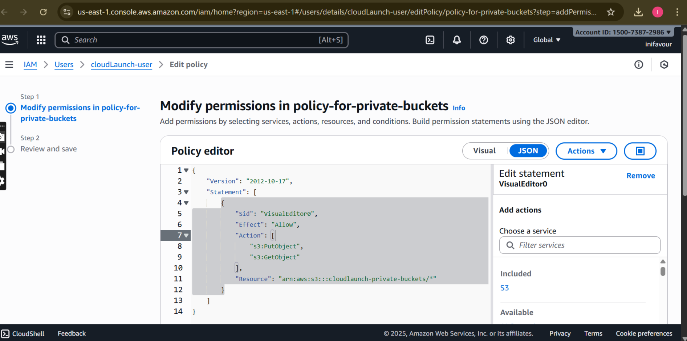
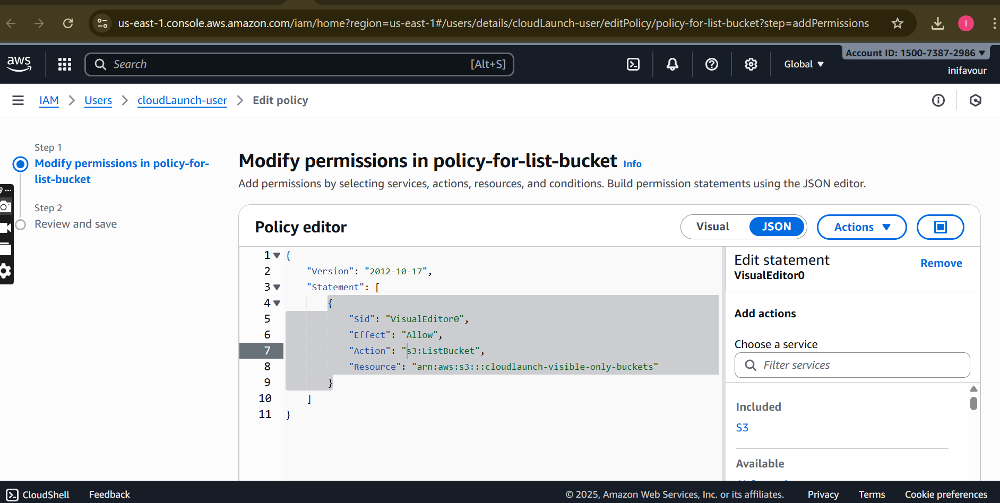

# 🌩️ CloudLaunch – AWS Deployment (AltSchool Cloud Engineering Assessment)

This repository contains my solution for the **AltSchool Cloud Engineering – Semester 3, Month 1 Assessment (Tinyuka 2024)**.  
The goal is to deploy a lightweight product called **CloudLaunch**, consisting of a static website and private document storage, while ensuring strict IAM access controls and designing a secure VPC environment.

---

## 📌 Task 1: Static Website Hosting Using S3 + IAM

### ✅ S3 Buckets
1. **cloudlaunch-site-buckets**
   - Hosts a simple static website (HTML/CSS/JS).
   - Static website hosting enabled.
   - Publicly accessible (read-only for anonymous users).
   - *(Bonus)* CloudFront distribution added for HTTPS and caching.

   🔗 **Website URL:** [http://cloudlaunch-site-buckets.s3-website-us-east-1.amazonaws.com](http://cloudlaunch-site-buckets.s3-website-us-east-1.amazonaws.com)  
   🔗 *(Optional)* **CloudFront URL:** https://dxxxxxxxxxxxxx.cloudfront.net

2. **cloudlaunch-private-buckets**
   - Private storage bucket.
   - Access restricted to a specific IAM user.
   - Permissions: `GetObject`, `PutObject` only.  
   - ❌ No `DeleteObject` allowed.

3. **cloudlaunch-visible-only-buckets**
   - Not publicly accessible.
   - IAM user can only `ListBucket` (see it exists).
   - ❌ No `GetObject` / `PutObject` allowed.

---

### ✅ IAM User
- **User:** `cloudLaunch-user`
- **Permissions (via custom IAM policy):**
  - `ListBucket` on all three buckets.
  - `GetObject` on `cloudlaunch-site-buckets`.
  - `GetObject` + `PutObject` on `cloudlaunch-private-buckets`.
  - No delete permissions anywhere.
  - No access to `cloudlaunch-visible-only-buckets` contents.
- Password reset enforced on first login.

📄 **IAM Policy JSON:** [iam-policy.json](iam-policy/iam-policy.json)

---

## 📌 Task 2: VPC Design for CloudLaunch Environment

### ✅ VPC Details
- **VPC Name:** `cloudlaunch-vpc`
- **CIDR Block:** `10.0.0.0/16`

### ✅ Subnets
- **Public Subnet:** `10.0.1.0/24` – for load balancers / future public-facing services.  
- **Application Subnet:** `10.0.2.0/24` – for app servers (private).  
- **Database Subnet:** `10.0.3.0/28` – for RDS-like services (private).

### ✅ Internet Gateway
- **cloudlaunch-igw** attached to VPC.

### ✅ Route Tables
- **cloudlaunch-public-rt**
  - Associated with Public Subnet.
  - Default route `0.0.0.0/0` → Internet Gateway.
- **cloudlaunch-app-rt** (Application Subnet)
  - No internet route (private).
- **cloudlaunch-db-rt** (Database Subnet)
  - No internet route (private).

### ✅ Security Groups
1. **cloudlaunch-app-sg**
   - Allows HTTP (Port 80) within VPC only.
2. **cloudlaunch-db-sg**
   - Allows MySQL (Port 3306) from **Application Subnet only**.

### ✅ IAM Permissions
- `cloudlaunch-user` has **read-only (list/view)** access to:
  - VPC
  - Subnets
  - Route tables
  - Security groups

---

## 📂 Repository Contents
- `README.md` → Project documentation (this file).
- `iam-policy.json` → Custom IAM policy attached to `cloudLaunch-user`.
- `s3-site/` → Basic HTML/CSS/JS files for CloudLaunch static site.

---

## 🔒 Account Details
- **Account Alias / ID:** `150073872986`
- **IAM User:** `cloudLaunch-user`
- **Console URL:** https://iniobongfavour.signin.aws.amazon.com/console
- **Login Credentials:** (submitted separately as required)  
  - Password reset enforced on first login.

---

## ✅ Evaluation Checklist
- [x] Static site hosted on S3.  
- [x] IAM user created with restricted policies.  
- [x] Private and visible-only buckets configured.  
- [x] Secure VPC with subnets, route tables, and SGs.  
- [x] Documentation provided in README.md.  
- [x] Bonus: CloudFront integration for HTTPS.  

---

### 🚀 CloudLaunch successfully deployed on AWS!

### This is the image of my policy for both the listed and private buckets

**This is my Image for my private policy**

**This is my Image for my list policy**                                                                                                                                                                                                                                                                                                                                                                       

